<h1 align="center">The Spa Stockholm</h1>

[View the live project here.](https://the-spa-df1f22d5aa6e.herokuapp.com/)

This is the main marketing site and sales channel for The Spa Stockholm, a spa in the heart of Sweden's vibrant capital. The Spa Stockholm, offers a sanctuary where customers can escape the hustle and bustle of everyday life and indulge in luxurious treatments for body, mind, and spirit.

<h2 align="center">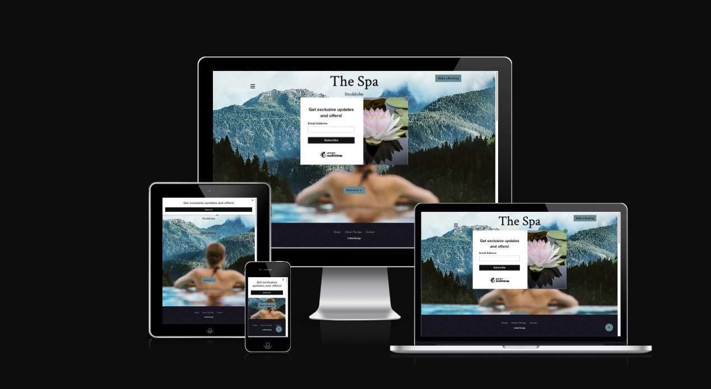</h2>


## E-commerce Model for The Spa Stockholm
### Business Focus: B2C (Business to Consumer)
The Spa Stockholm's e-commerce platform will primarily focus on a B2C model, targeting individual consumers seeking luxurious spa treatments and wellness products. This model aligns with the spa's mission to provide personalised and exceptional service to its clients, enhancing their relaxation and well-being.
### Core Business Intents
#### Online Booking System:
Purpose: Streamline the appointment scheduling process, allowing clients to book treatments and services online at their convenience.
##### Features:
Real-time availability of treatments.
Easy rescheduling and cancellation options (to be added).
Automated confirmation of booking (also add automated reminders of appointments via email or/and sms).
##### E-commerce Store for Products (products are not yet a feature):
Purpose: Expand the spa's revenue streams by selling premium skincare products and wellness items online.
###### Features:
Wide range of products from leading skincare brands.
Detailed product descriptions and customer reviews.
Membership discounts and special promotions.
#### Membership and Gift Cards:
Purpose: Enhance customer loyalty and attract new clients through membership programs and gift cards.
##### Features:
Different membership tiers offering exclusive benefits and discounts.
Purchase and redemption of gift cards online.
Special packages for corporate gifting.
##### Exclusive Spa Packages (to be added):
Purpose: Provide clients with bundled treatment options tailored to their specific needs.
##### Features:
Customisable spa packages for various wellness goals.
Seasonal and thematic packages.
#### Discounts for package bookings.
Customer Reviews and Testimonials (to be added):
Purpose: Build trust and credibility by showcasing positive client experiences.
##### Features:
Section for customers to leave reviews and ratings.
Display of testimonials on the homepage and relevant service pages.

### Marketing Strategies
#### Search Engine Optimisation (SEO):
Optimise the website for search engines to improve visibility and attract organic traffic.
Focus on keywords related to spa treatments, wellness products, and luxury relaxation.
#### Social Media Marketing:
Leverage platforms like Instagram (to be added), Facebook, and Pinterest (to be added) to showcase the spa's serene environment, treatments, and products.
Use influencer partnerships within the beauty sector to reach a broader audience.
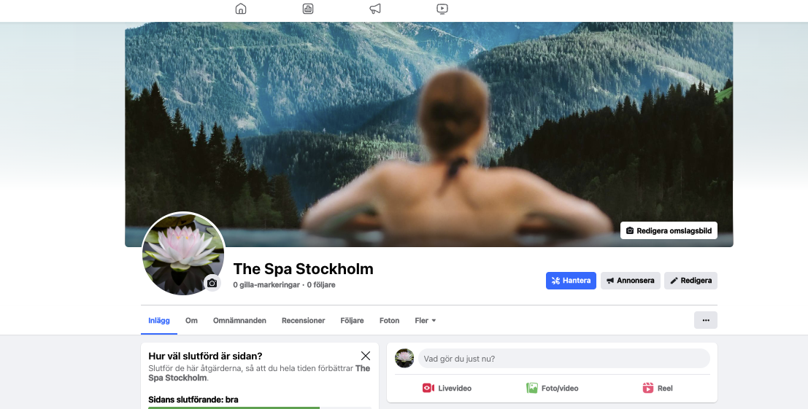

#### Email Marketing:
Build a mailing list to send newsletters, special offers, and updates.
Personalised email campaigns based on customer preferences and purchase history.
#### Content Marketing:
Create a blog featuring articles on wellness, skincare tips, and the benefits of spa treatments.
Use high-quality images and videos to engage visitors.
#### Online Advertisements:
Run targeted ads on Google and social media platforms to reach potential clients.
Retargeting ads to convert visitors who have previously shown interest in the spa.
#### Partnerships and Collaborations:
Collaborate with hotels, travel agencies, and wellness influencers to create exclusive offers.
Partner with local businesses for cross-promotional opportunities.

### Implementation Plan
#### Website Development:
- Design a user-friendly and aesthetically pleasing website that reflects the spa's luxurious brand.
- Ensure the site is mobile-friendly and optimised for speed.
#### Integration of Booking and E-commerce Systems:
Choose and integrate reliable software for online bookings and product sales.
Ensure secure payment processing and data protection.
#### Content Creation:
Develop high-quality content, including professional photos, videos, and blog articles.
Regularly update content to keep the website fresh and engaging.
#### Launch and Promotion:
Plan a launch campaign to generate buzz and attract initial traffic.
Use promotional offers to encourage early bookings and product purchases.
#### Ongoing Optimisation and Support:
Continuously monitor website performance and user feedback.
Regularly update the site with new treatments, products, and content based on customer needs and market trends.
## Conclusion
The e-commerce model for The Spa Stockholm will enhance the customer experience by providing convenient online booking, an extensive range of products, and personalised service options. By leveraging effective marketing strategies and a user-friendly website, The Spa Stockholm can attract a wider audience, increase revenue, and establish itself as a premier destination for luxury wellness in Stockholm.

## User Experience (UX)

-   ### User stories

    -   #### Visitor Goals/User Stories/Testing User Stories from User Experience (UX)

        1. As a First Time Visitor/user, I want to easily understand the main purpose of the site and learn more about the Spa: The Home page and Home section displays the logo and a Hero image which immediately gives the uer an idea what the website is about. it also displays a Read more button which takes the user directly to the section giving the user more information about The Spa. In the about section there is also a read more about us buttonwhich takes the user to a page with more comprehensive information about The Spa. This page is also linked in the footer that is displayed on every page of the website. 

        2. As a user I want to easily get in contact with The Spa to get any questions answered.
        If  as user has any queries there is also a contact link in the footer (visible on all pages)

        3. As a First Time Visitor/user, I want to be able to easily navigate throughout the site to find content. The Spa's main navbar is a dropdown navbar displayed as a hamburder menu on all screens sizes. In it are links to the most essential pages and sections. there ae also buttons convenitently placed through out the site to make navigation easier.

        4. As a First Time Visitor, I want to easily locate the Spa's social media link(s) to see their followings on social media to determine how trusted and known they are. The link to FB is threfore placed in the main navbar.

        5. As a First Time or returning Visitor/user (logged in or not), I want to easily brows the services available. These are therefore placed on the landing page and can be reached by manually scrolling or via the dropdown links in the menu which scrolls directly to the section. In the Treatments section the treaments are presented and can be clicked for more indepth information about the service.

        6. As a customer/user I want to be able to select services and add them to the cart. There are threfore two buttons with booking messages on the site. One in the second navbar visible on al pages and one inte the prices and booking section (reached via the dropdown navbar).

        7. As a user/customer I want to easilyt chose a service and add to my cart. I also wantot be able to delete, increase quantity and update my cart before going to checkout and payment which is possible in the cart via buttons to update, increase quaantity (only relevant for Spa access). The user can also easily navigate back via a button to add more service to their cart. 

        8. As a customer/user I want to be able to pay for my selected services and receive a confirmation of my booking/purchase. when the services have been selected and added to the cart the user can click the button and go to checkout and fill out their payment information and then make the payment. A booking confirmation message is displayed and the user is also redireced to a booking confirmation page with more information, at the same time an email is sent to their registered email.

        9. As a user I want to connect with the Spa and keep updated about events, special offers etc. I also want to follow the Spa on Social Media and be able sign-up for, and receive promotional emails from The Spa. The FB button is located in the dropdown menu so the user can easily find it The Spa uses Mail Chimp to handle their newsletters and a pop-up is conviently displayed to the user to sign-up for newsletters, promotions etc.

        10. As a user/customer, first time or returning, I want to easily register an account/profile and know that my account was successfully registered. The link for registration is located in the dropdown menu and takes the user to a registration form. A confirmations page is displayed after registering letting the uer know they need to confirm their email beofore login.
        
        11. As a user I want to be able to easily log in and logout: I want to access my personal account information, and I want to have a personalised UserProfile, where I can view my bookings/purchases. login and logout links are located in the dropdown menu and conveniently logs the user into the account and takes the user to a logout page which checks if they are sure they want to log out.

        12. As customer/user I want to easily update my profile informatio (email, phone number) and this can be done on the profile page accessed via the dropdown menu when the uer is logged in. When profile is updated a confirmation message is displayed on the screen.

        13. As customer/user I want to easily delete my account/profile and assocciated account information, there is therefore a link to a delete page located in the dropdoen menu accessible for logged in users. Here the user is asked if the are sure they want to delete the account, if the click the delte button the account is deleted and a message is displaye informting them the account has been deleted, they are logged out and returne to the Home page.

-   ### Design
    -   #### Colour Scheme
        -   The colours used fot The Spa website are soft and harmonious. The main colours is a dark blue, light blue and a blue green colour, complemented by white, soft grey and off-white colours to give the site a harmonious feeling.
    -   #### Typography
        -   The Crimson font is the main font used throughout the whole website with Serif as the fallback font in case for any reason the font isn't being imported into the site correctly. Crimson is a serif font well suited to, so it is both attractive and appropriate.
    -   #### Imagery
        -   Imagery is important. The large, background hero image in the Home section on the Home page is chosen to be striking and catch the user's attention. 

### Wireframes

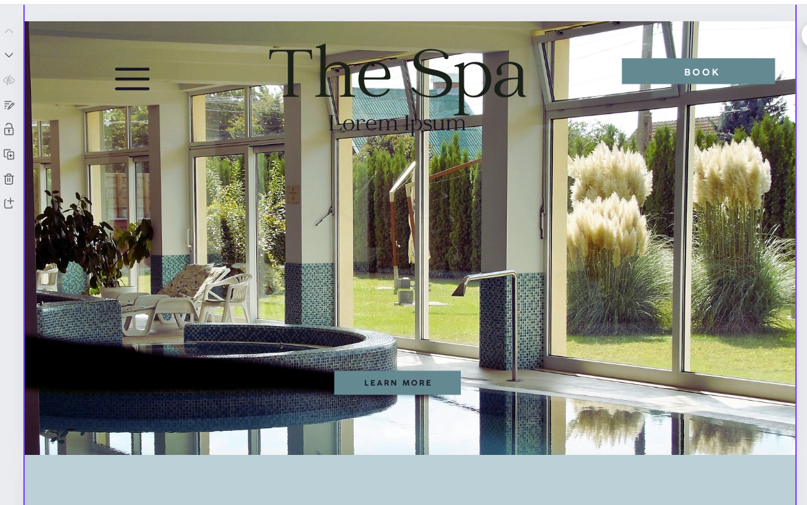
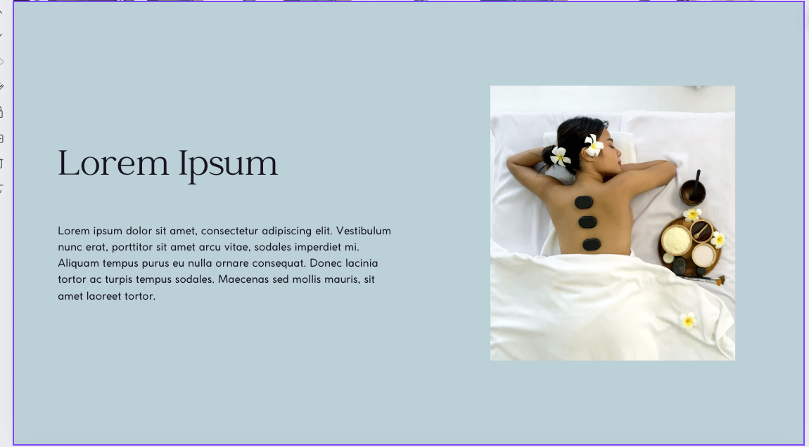
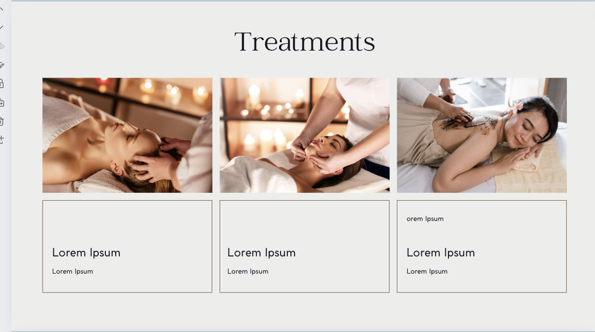
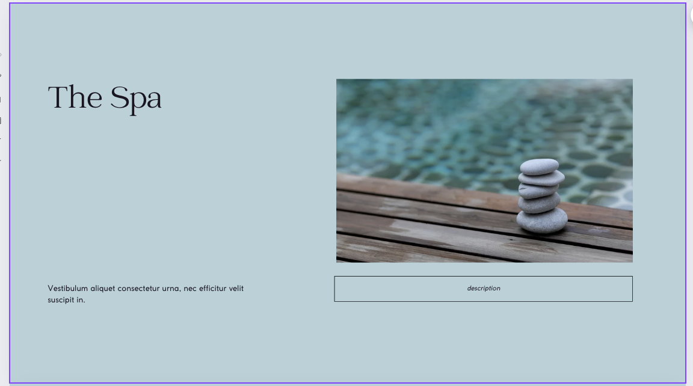
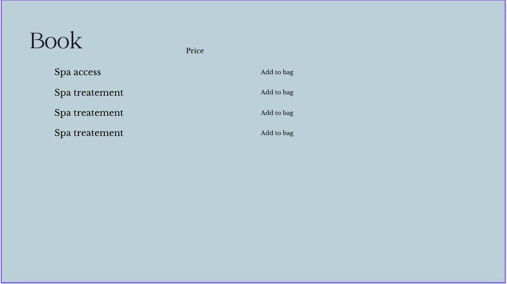
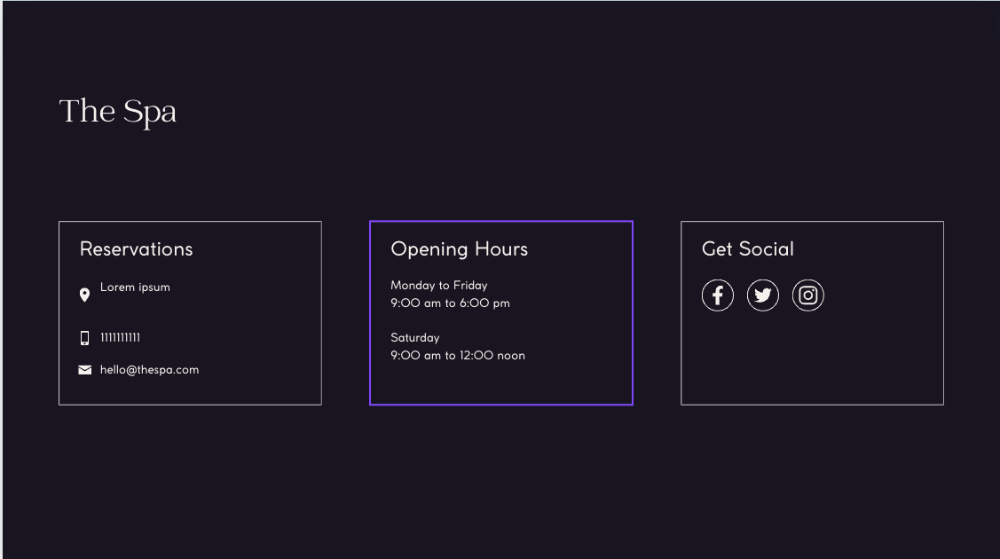


### Models/ERDs
 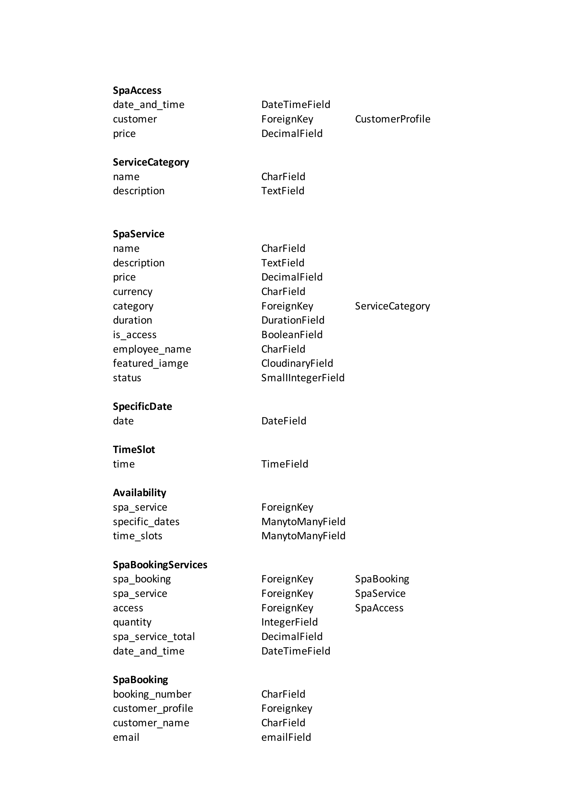
 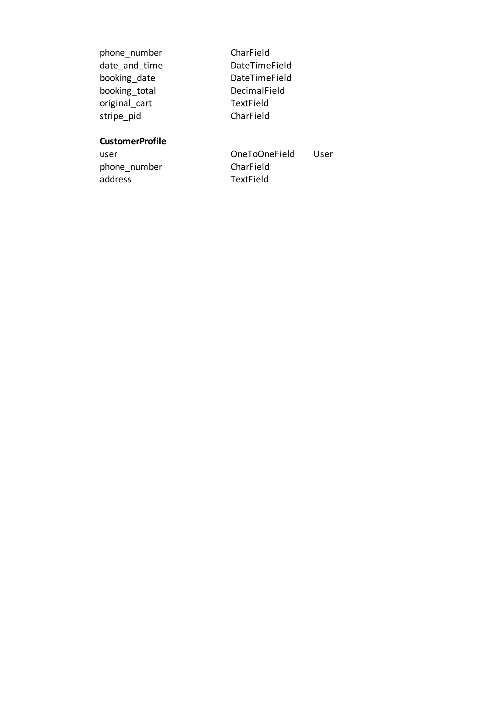


 - **Kanban Board**
-  [View](assets_readme/images/spa_erds.pdf)
 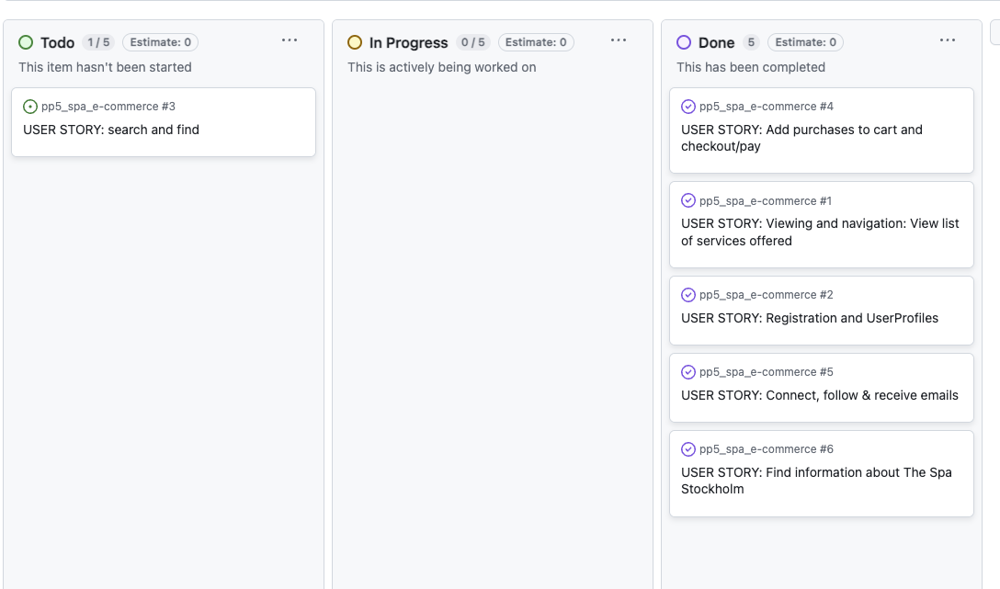
 https://github.com/users/CeciliaSG/projects/5/views/1

## Site images (pages, sections, features etc.)

### Home Page


<br>

### Dropdown Menu
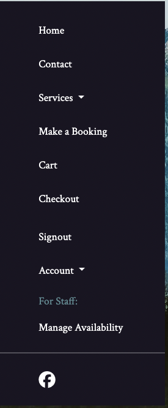

<br>

### Dropdown Menu
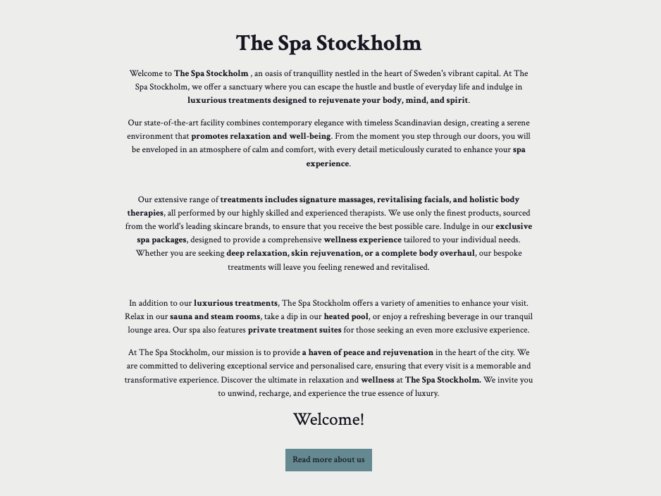

<br>

### Contact
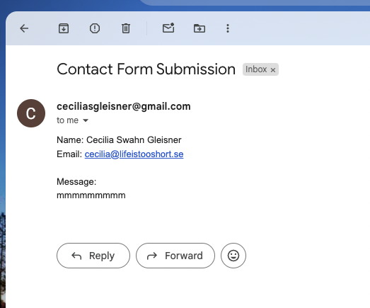
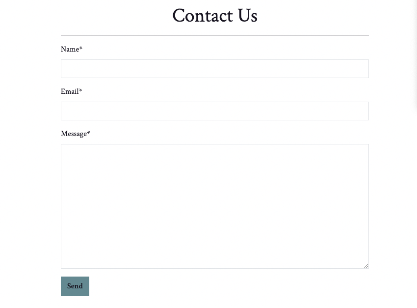


## Features

-   Responsive on all device sizes

-   Interactive elements

## Technologies Used

### Languages Used

-   [HTML5](https://en.wikipedia.org/wiki/HTML5)
-   [CSS3](https://en.wikipedia.org/wiki/Cascading_Style_Sheets)
-   [Bootstrap](https://en.wikipedia.org/wiki/Bootstrap_(front-end_framework))
-   [Django](https://en.wikipedia.org/wiki/Django)
-   [Javascript](https://en.wikipedia.org/wiki/JavaScript)
-   [Python](https://en.wikipedia.org/wiki/Python_(programming_language))

### Frameworks, Libraries & Programs Used

1. [Bootstrap 5:](https://getbootstrap.com/docs/4.4/getting-started/introduction/)
    - Bootstrap was used to assist with the responsiveness and styling of the website.
2. [Google Fonts:](https://fonts.google.com/)
    - Google fonts were used to import the 'Titillium Web' font into the style.css file which is used on all pages throughout the project.
3. [Font Awesome:](https://fontawesome.com/)
    - Font Awesome was used on all pages throughout the website to add icons for aesthetic and UX purposes.
4. [jQuery:](https://jquery.com/)
    - jQuery came with Bootstrap to make the navbar responsive but was also used for the smooth scroll function in JavaScript.
5. [Git](https://git-scm.com/)
    - Git was used for version control by utilizing the Gitpod terminal to commit to Git and Push to GitPod.
6. [GitHub:](https://github.com/)
    - GitHub is used to store the projects code after being pushed from Git.
7. [Canva:](https://canva.com/)
    - Canva was used to create the [wireframes](https://github.com/) during the design process 
9. [Tiny PNG](https://tinypng.com/) 
    - Tiny PNG was used to compress the images
10. [Cloudinary](cloudinary.com)
    - Cloudinary was used to serve the service images uploaded via the admin panel.
11. [Realfavicongenerator](realfavicongenerator.net)
    - Realfavicongenerator was used to generate a favicon.

## Testing

### Validator Testing 

The W3C Markup Validator and W3C CSS Validator Services were used to validate every page of the project to ensure there were no syntax errors in the project.

- No error were found when passing the code through JSHint: [JS Hint](https://jshint.com/) 
- No error were found when passing the code through Python Linter: [CI Python Linter](https://pep8ci.herokuapp.com/)
- No other errors were returned when passing through the official: [W3C validator](https://validator.w3.org/)
- No errors were found when passing through the official (Jigsaw) validator: [https://jigsaw.w3.org/]

<br>

### Lighthouse testing

- Mobile (third party cookies and Cloudinary are causing issues)
 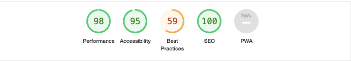
- Desktop (third party cookies and Cloudinary are causing issues)
 


### Further Testing

-   The Website was tested on Google Chrome and Safari browsers.
-   The website was viewed on a variety of devices such as Desktop, Laptop, Galaxy, Iphone and Ipad.
-   A large amount of testing was done to ensure that all pages were linking correctly and that buttons, other linksa and forms are working.

### Features Left to Implement

- The Admin panel needs to be developed and made better. it works but it is not ideal for adding treatments7service, dates and times.
- Employed users should be able to adminstrate the treatments etc from the front end.
- Customers hould be able to choose a therapist when booking.
- The prices section should be developed.

<br>

### Unfixed Bugs

<br>

### Known Bugs

## Deployment

### GitHub Pages

The project was deployed to GitHub Pages using the following steps...

1. Log in to GitHub and locate the [GitHub Repository](https://github.com/)
2. At the top of the Repository (not top of page), locate the "Settings" Button on the menu.
    - Alternatively Click [Here](https://raw.githubusercontent.com/) for a GIF demonstrating the process starting from Step 2.
3. Scroll down the Settings page until you locate the "GitHub Pages" Section.
4. Under "Source", click the dropdown called "None" and select "Master Branch".
5. The page will automatically refresh.
6. Scroll back down through the page to locate the now published site [link](https://github.com) in the "GitHub Pages" section.

### Forking the GitHub Repository

By forking the GitHub Repository we make a copy of the original repository on our GitHub account to view and/or make changes without affecting the original repository by using the following steps...

1. Log in to GitHub and locate the [GitHub Repository](https://github.com/)
2. At the top of the Repository (not top of page) just above the "Settings" Button on the menu, locate the "Fork" Button.
3. You should now have a copy of the original repository in your GitHub account.

### Making a Local Clone

1. Log in to GitHub and locate the [GitHub Repository](https://github.com/)
2. Under the repository name, click "Clone or download".
3. To clone the repository using HTTPS, under "Clone with HTTPS", copy the link.
4. Open Git Bash
5. Change the current working directory to the location where you want the cloned directory to be made.
6. Type `git clone`, and then paste the URL you copied in Step 3.

```
$ git clone https://github.com/YOUR-USERNAME/YOUR-REPOSITORY
```

7. Press Enter. Your local clone will be created.

```
$ git clone https://github.com/YOUR-USERNAME/YOUR-REPOSITORY
> Cloning into `CI-Clone`...
> remote: Counting objects: 10, done.
> remote: Compressing objects: 100% (8/8), done.
> remove: Total 10 (delta 1), reused 10 (delta 1)
> Unpacking objects: 100% (10/10), done.
```

Click [Here](https://help.github.com/en/github/creating-cloning-and-archiving-repositories/cloning-a-repository#cloning-a-repository-to-github-desktop) to retrieve pictures for some of the buttons and more detailed explanations of the above process.

## Creating the Heroku app, deploying to Heroku

Steps to follow for deployment to Heroku:

### In GitHub.
1. Navigate to the repository for the project. 

### In Heroku

1.  Go to Heroku, create account, if you don't have one, and log in.
2.  Go to the dashboard and click New after which you click Create new app
3.  Choose name and region. Click Create app
4.  Go to Settings, under the "Config Vars" set your Key/Value Pairs.
    You must then create a _Config Var_ called `PORT`. Set this to `8000`
    If you have credentials, you must create another _Config Var_ called `CREDS` and paste the JSON into the value field.
    When you create the app, you will need to add two buildpacks from the _Settings_ tab. The ordering is as follows:
    1. `heroku/python`
    2. `heroku/nodejs`

5.  In the Buildpacks section, add buildpacks. Note order in which you add buildpacks: Python first and nodejs.
6.  No go to Deployment. In deployment method click on "GitHub"(for repository)
7.  The connect to GitHub, find your repository and click  connect.
8.  Under connect to GitHub-section, you can either chose automatic deploys with Enable Automatic Deploys or Manual Deploy, to deploy manually.
    
    **Now you can view the deployed app.**


## Credits

### Code

-   [Bootstrap5](https://getbootstrap.com/docs/5.3/getting-started/introduction/): Bootstrap Library used throughout the project mainly to make site responsive using the Bootstrap Grid System.

-   [Stack Overflow/editing-inline-formset](https://stackoverflow.com/questions/66814402/python-django-editing-inlineformset-factory)

-   [Stack Overflow/inlineformset](https://stackoverflow.com/questions/3367741/inlineformset-factory-composed-of-modelform)

-   [Stack Overflow/add-form-validation](https://stackoverflow.com/questions/68382186/django-add-form-validation-to-inlineformset-factory)

-   [Stack Overflow/dayandtimepicker](https://stackoverflow.com/questions/62315482/django-day-and-time-picker/62316055#62316055)

-   [Stack Overflow/datetimefromtorange](https://stackoverflow.com/questions/54825483/combine-django-filter-datetimefromtorangefilter-and-datetimeinputdatepicker)

-   [Stack Overflow/date-time-picker](https://nancylin.xyz/how-to-implement-date-time-picker-in-django-without-javascript/)

-   [Stack Overflow/date-picker](https://simpleisbetterthancomplex.com/tutorial/2019/01/03/how-to-use-date-picker-with-django.html)

-   [Stack Overflow/changing navbar colour](https://stackoverflow.com/questions/23706003/changing-nav-bar-color-after-scrolling)

- [Stack Overflow/scrollintoview](https://stackoverflow.com/questions/57694951/using-scrollintoview-function-to-specific-html-tag)

- [Stack Overflow/scrollspy_navigate_to](https://stackoverflow.com/questions/23506975/scrollspy-navigate-to-different-page-and-back-at-same-position)

- [Stack Overflow/scroll-automatically](https://stackoverflow.com/questions/11715646/scroll-automatically-to-the-bottom-of-the-page/11715670#11715670)

- [www.w3schools.com/input-type-date](https://www.w3schools.com/tags/att_input_type_date.asp#:~:text=The%20%3Cinput%20type%3D%22date,tag%20for%20best%20accessibility%20practices!)


#### Forms
- [www.geeksforgeeks.org](https://developer.mozilla.org/en-US/docs/Learn/Server-side/Django/Forms)
- [docs.djangoproject.com](https://docs.djangoproject.com/en/5.0/topics/forms/)
- [developer.mozilla.org](https://developer.mozilla.org/en-US/docs/Learn/Server-side/Django/Forms)

### Content

-   Some content was generated by AI, specifally the treatments texts.

### Media

-   [Unsplash](https://unsplash.com/) All Images were downloaded from Unsplash.
-   [Realfavicongenerator](realfavicongenerator.net) The Favicon was created with realfavicongenerator.net

### Acknowledgements

-   My Mentor for continuous helpful feedback.

-   Tutor support at Code Institute for their support and help.