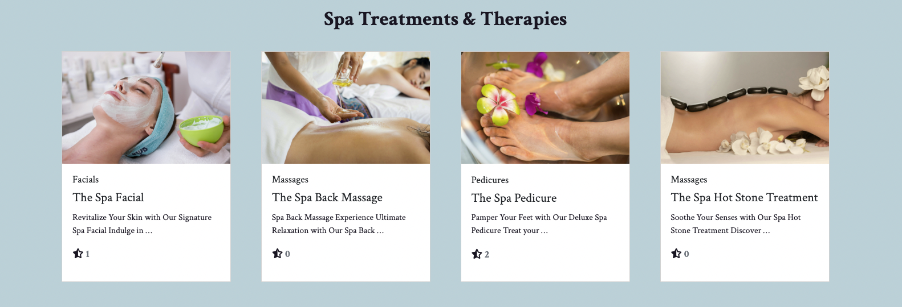
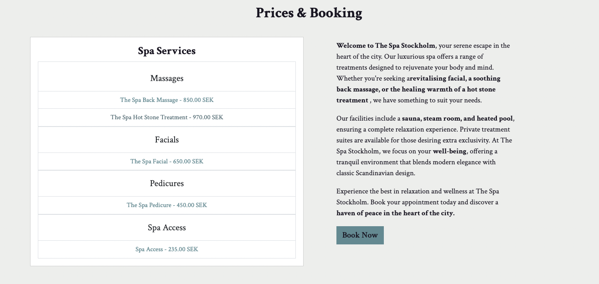

<h1 align="center">The Spa Stockholm</h1>

[View the live project here.](https://the-spa-df1f22d5aa6e.herokuapp.com/)

This is the main marketing site and sales channel for The Spa Stockholm, a spa in the heart of Sweden's vibrant capital. The Spa Stockholm, offers a sanctuary where customers can escape the hustle and bustle of everyday life and indulge in luxurious treatments for body, mind, and spirit.

<h2 align="center"></h2>


## E-commerce Model for The Spa Stockholm
### Business Focus: B2C (Business to Consumer)
The Spa Stockholm's e-commerce platform will primarily focus on a B2C model, targeting individual consumers seeking luxurious spa treatments and wellness products. This model aligns with the spa's mission to provide personalised and exceptional service to its clients, enhancing their relaxation and well-being.
### Core Business Intents
#### Online Booking System:
Purpose: Streamline the appointment scheduling process, allowing clients to book treatments and services online at their convenience.
##### Features:
Real-time availability of treatments.
Easy rescheduling and cancellation options (to be added).
Automated confirmation of booking (also add automated reminders of appointments via email or/and sms).
##### E-commerce Store for Products (products are not yet a feature):
Purpose: Expand the spa's revenue streams by selling premium skincare products and wellness items online.
###### Features:
Wide range of products from leading skincare brands.
Detailed product descriptions and customer reviews.
Membership discounts and special promotions.
#### Membership and Gift Cards:
Purpose: Enhance customer loyalty and attract new clients through membership programs and gift cards.
##### Features:
Different membership tiers offering exclusive benefits and discounts.
Purchase and redemption of gift cards online.
Special packages for corporate gifting.
##### Exclusive Spa Packages (to be added):
Purpose: Provide clients with bundled treatment options tailored to their specific needs.
##### Features:
Customisable spa packages for various wellness goals.
Seasonal and thematic packages.
#### Discounts for package bookings.
Customer Reviews and Testimonials (to be added):
Purpose: Build trust and credibility by showcasing positive client experiences.
##### Features:
Section for customers to leave reviews and ratings.
Display of testimonials on the homepage and relevant service pages.

### Marketing Strategies
#### Search Engine Optimisation (SEO):
Optimise the website for search engines to improve visibility and attract organic traffic.
Focus on keywords related to spa treatments, wellness products, and luxury relaxation.
#### Social Media Marketing:
Leverage platforms like Instagram (to be added), Facebook, and Pinterest (to be added) to showcase the spa's serene environment, treatments, and products.
Use influencer partnerships within the beauty sector to reach a broader audience.


#### Email Marketing:
Build a mailing list to send newsletters, special offers, and updates.
Personalised email campaigns based on customer preferences and purchase history.
#### Content Marketing:
Create a blog featuring articles on wellness, skincare tips, and the benefits of spa treatments.
Use high-quality images and videos to engage visitors.
#### Online Advertisements:
Run targeted ads on Google and social media platforms to reach potential clients.
Retargeting ads to convert visitors who have previously shown interest in the spa.
#### Partnerships and Collaborations:
Collaborate with hotels, travel agencies, and wellness influencers to create exclusive offers.
Partner with local businesses for cross-promotional opportunities.

### Implementation Plan
#### Website Development:
- Design a user-friendly and aesthetically pleasing website that reflects the spa's luxurious brand.
- Ensure the site is mobile-friendly and optimised for speed.
#### Integration of Booking and E-commerce Systems:
Choose and integrate reliable software for online bookings and product sales.
Ensure secure payment processing and data protection.
#### Content Creation:
Develop high-quality content, including professional photos, videos, and blog articles.
Regularly update content to keep the website fresh and engaging.
#### Launch and Promotion:
Plan a launch campaign to generate buzz and attract initial traffic.
Use promotional offers to encourage early bookings and product purchases.
#### Ongoing Optimisation and Support:
Continuously monitor website performance and user feedback.
Regularly update the site with new treatments, products, and content based on customer needs and market trends.
## Conclusion
The e-commerce model for The Spa Stockholm will enhance the customer experience by providing convenient online booking, an extensive range of products, and personalised service options. By leveraging effective marketing strategies and a user-friendly website, The Spa Stockholm can attract a wider audience, increase revenue, and establish itself as a premier destination for luxury wellness in Stockholm.

## User Experience (UX)

-   ### User stories

    -   #### Visitor Goals/User Stories/Testing User Stories from User Experience (UX)

        1. As a First Time Visitor/user, I want to easily understand the main purpose of the site and learn more about the Spa: The Home page and Home section displays the logo and a Hero image which immediately gives the uer an idea what the website is about. it also displays a Read more button which takes the user directly to the section giving the user more information about The Spa. In the about section there is also a read more about us buttonwhich takes the user to a page with more comprehensive information about The Spa. This page is also linked in the footer that is displayed on every page of the website. 

        2. As a user I want to easily get in contact with The Spa to get any questions answered.
        If  as user has any queries there is also a contact link in the footer (visible on all pages)

        3. As a First Time Visitor/user, I want to be able to easily navigate throughout the site to find content. The Spa's main navbar is a dropdown navbar displayed as a hamburder menu on all screens sizes. In it are links to the most essential pages and sections. there ae also buttons convenitently placed through out the site to make navigation easier.

        4. As a First Time Visitor, I want to easily locate the Spa's social media link(s) to see their followings on social media to determine how trusted and known they are. The link to FB is threfore placed in the main navbar.

        5. As a First Time or returning Visitor/user (logged in or not), I want to easily brows the services available. These are therefore placed on the landing page and can be reached by manually scrolling or via the dropdown links in the menu which scrolls directly to the section. In the Treatments section the treaments are presented and can be clicked for more indepth information about the service.

        6. As a customer/user I want to be able to select services and add them to the cart. There are threfore two buttons with booking messages on the site. One in the second navbar visible on al pages and one inte the prices and booking section (reached via the dropdown navbar).

        7. As a user/customer I want to easilyt chose a service and add to my cart. I also wantot be able to delete, increase quantity and update my cart before going to checkout and payment which is possible in the cart via buttons to update, increase quaantity (only relevant for Spa access). The user can also easily navigate back via a button to add more service to their cart. 

        8. As a customer/user I want to be able to pay for my selected services and receive a confirmation of my booking/purchase. when the services have been selected and added to the cart the user can click the button and go to checkout and fill out their payment information and then make the payment. A booking confirmation message is displayed and the user is also redireced to a booking confirmation page with more information, at the same time an email is sent to their registered email.

        9. As a user I want to connect with the Spa and keep updated about events, special offers etc. I also want to follow the Spa on Social Media and be able sign-up for, and receive promotional emails from The Spa. The FB button is located in the dropdown menu so the user can easily find it The Spa uses Mail Chimp to handle their newsletters and a pop-up is conviently displayed to the user to sign-up for newsletters, promotions etc.

        10. As a user/customer, first time or returning, I want to easily register an account/profile and know that my account was successfully registered. The link for registration is located in the dropdown menu and takes the user to a registration form. A confirmations page is displayed after registering letting the uer know they need to confirm their email beofore login.
        
        11. As a user I want to be able to easily log in and logout: I want to access my personal account information, and I want to have a personalised UserProfile, where I can view my bookings/purchases. login and logout links are located in the dropdown menu and conveniently logs the user into the account and takes the user to a logout page which checks if they are sure they want to log out.

        12. As customer/user I want to easily update my profile informatio (email, phone number) and this can be done on the profile page accessed via the dropdown menu when the uer is logged in. When profile is updated a confirmation message is displayed on the screen.

        13. As customer/user I want to easily delete my account/profile and assocciated account information, there is therefore a link to a delete page located in the dropdoen menu accessible for logged in users. Here the user is asked if the are sure they want to delete the account, if the click the delte button the account is deleted and a message is displaye informting them the account has been deleted, they are logged out and returne to the Home page.

-   ### Design
    -   #### Colour Scheme
        -   The colours used for The Spa website are soft and harmonious. The main colours is a dark blue, light blue and a blue green colour, complemented by white, soft grey and off-white colours to give the site a harmonious feeling.
    -   #### Typography
        -   The Crimson font is the main font used throughout the whole website with Serif as the fallback font in case for any reason the font isn't being imported into the site correctly. Crimson is a serif font well suited to, so it is both attractive and appropriate.
    -   #### Imagery
        -   Imagery is important. The large, background hero image in the Home section on the Home page is chosen to be striking and catch the user's attention. 

### Wireframes


### Models/ERDs
 
 


### Kanban Board
[View Board](https://github.com/users/CeciliaSG/projects/5/views/1)

## Site images (pages, sections, features etc.)

### Home Page


<br>

### Dropdown Menu


<br>

### About Section


<br>

### Treatments Section


<br>

### Booking Page


<br>

### Prices & Booking Section


<br>

### Contact


### Facebook page


### Email Confirmation


<br>

### Profile Page


<br>


## Features

-   Responsive on all device sizes

-   Interactive elements

## Technologies Used

### Languages Used

-   [HTML5](https://en.wikipedia.org/wiki/HTML5)
-   [CSS3](https://en.wikipedia.org/wiki/Cascading_Style_Sheets)
-   [Bootstrap](https://en.wikipedia.org/wiki/Bootstrap_(front-end_framework))
-   [Django](https://en.wikipedia.org/wiki/Django)
-   [Javascript](https://en.wikipedia.org/wiki/JavaScript)
-   [Python](https://en.wikipedia.org/wiki/Python_(programming_language))

### Frameworks, Libraries & Programs Used

1. [Bootstrap 5:](https://getbootstrap.com/docs/4.4/getting-started/introduction/)
    - Bootstrap was used to assist with the responsiveness and styling of the website.
2. [Google Fonts:](https://fonts.google.com/)
    - Google fonts were used to import the 'Titillium Web' font into the style.css file which is used on all pages throughout the project.
3. [Font Awesome:](https://fontawesome.com/)
    - Font Awesome was used on all pages throughout the website to add icons for aesthetic and UX purposes.
4. [jQuery:](https://jquery.com/)
    - jQuery came with Bootstrap to make the navbar responsive but was also used for the smooth scroll function in JavaScript.
5. [Git](https://git-scm.com/)
    - Git was used for version control by utilizing the Gitpod terminal to commit to Git and Push to GitPod.
6. [GitHub:](https://github.com/)
    - GitHub is used to store the projects code after being pushed from Git.
7. [Canva:](https://canva.com/)
    - Canva was used to create the [wireframes](https://github.com/) during the design process 
9. [Tiny PNG](https://tinypng.com/) 
    - Tiny PNG was used to compress the images
10. [Cloudinary](cloudinary.com)
    - Cloudinary was used to serve the service images uploaded via the admin panel.
11. [Realfavicongenerator](realfavicongenerator.net)
    - Realfavicongenerator was used to generate a favicon.


## Testing

The sites content and features are available to all user whether logged in or not. But only registered users can access their account and the information associated with it, such as for example their bookings.

Only registered staff members can access the Manage Time slot section which is a frond end extension of the back admin to make it easy to add or delete available time slots for services and dates.

- __Navigation Bars: Sticky Navbar and Dropdown Navbar__

- Featured on all pages, the fully responsive navbar includes the logo which also works as a link back to the home page and a Make a Booking button that takes the user to the booking page.

  - Featured on all pages, the fully responsive dropdown navigation bar on left hand side includes links to Services (with its own dropdowns linking to sections treatments and prices & booking), cart, checkout, Sign-in, sign-out (when the user is signed in, Register (Account when the user is signed in), Delete Account (when signed in) – and for Staff a link to Manage Availability (admin) from the front end (only visible when a user is logged in and staff). It also includes a Home-link and a Facebook-link linking to the Spas FB-page.

The navbars are identical on every page to allow for easy navigation.
  - This section will allow the user (logged-in and non-authenticated) to easily navigate from page to page across all devices without having to revert to the previous page via the ‘back’ button. 

  - The featured logo works as the link to the home/landing page.

Testing sticky navbar and logo-link:
Expected: 

The Book now button is expected to take the user to the booking page/feature when the user clicks the link.

Clicking the logo is expected to take the user back to the home page.

Testing: Tested the button and logo by clicking them.

Result: The links link to the correct pages/endpoints when clicked. And the logo works as a link back to the home page.

Testing dropdown navbar for logged-out users. Links: services, sign-in, register, book now, cart and checkout:

Expected: The links are expected to take the user to the declared page/feature when the user clicks the link.

Testing: Tested the links by clicking them.

Result: The links home, register, cart, sign-in and FB-symbol takes the user correct pages/endpoints when clicked.

**Checkout** can only be accessed when there is something in the cart, otherwise the user will get a message telling them there is nothing in the cart.

**Services** displays a dropdown when clicked with links to the sections: treatments and prices & booking. When these links are clicked the page scrolls down to these sections on the home page – from any page.

**Comment:** It was noted it would be beneficial to users to have a booking link in the dropdown menu, so a link to the booking page was added.

Testing dropdown navbar for logged-in users. Links only visible when logged in: sign-out, Account, Delete Account. Links for staff that are logged in: Manage Availability

Expected: The links are expected to take the user to the declared page/feature when the user clicks the link.

Testing: Tested the links by clicking them.

Result: The links takes the user correct pages/endpoints when clicked.


<br>

- __The Footer__ 

-	Featured on all pages and visible for both logged-out and logged in users.
-	Includes links to pages: Home, About the Spa and Contact.

<br>

Expected: The links are expected to take the user to the declared destination when the user clicks the link.

Testing: Tested the links by clicking them.

Result: The links link to the correct pages/endpoints.


</br>


### Landing/Home page (index.html)
- __The landing page__

  - The top of the landing page features a hero image, the section below gives the users an overview of the Spa is about. All content is accessible for all users. The page is divided into sections which can be reached by scrolling down or using the links linking to specific sections. The first section acts as the landing “page” and features a hero image and the top navbar with the logo and Make a booking button is clearly visible.

  - The About section features a text about the spa and there is also a button that will take the user to a page where they can read more about the spa.


<br>


Testing Spa Treatments & Therapies section: 

The section features cards with images and excerpts text for spa treatments, and each card can be clicked linking the user to a details page with more information about the treatment. The cards also feature a count of reviews left for each treatment.

Expected: 
- The links take the users to the correct details page.

-	Testing: 
- Post-links were clicked.

-	Result: 
-	The links take the user to the correct post-details page.
-	

Testing Prices & Booking section: 

The section features a list of spa services grouped into main headings: Massages, Facials, Pedicures & Spa Access (more to be added in the future). Under each heading the Spa treatments are listed as links so that users can click the link and read more about the treatment. The section also features a text about the spa and the treatments as well as Book Now button that will take the user to the booking page.

Expected: 
- The treatment links take the users to the correct details page.
- The Book now Button takes the user to the booking page.

-	Testing: 
- The links were clicked.
- The button was clicked.

-	Result: 
-	The links take the user to the correct details page.
-	The button takes the user to the booking page.


**Testing the Details page:**
- __The Details page__

The details page features a text about the treatment, details about duration, price etc. as well as a book now button.

There is also a function to add a review for the treatment.

<br>


<br>


Expected: 
- The Book now Button takes the user to the booking page.
- By writing a review and submitting it the review should be submitted for review. The review should be shown as awaiting approval.

-	Testing: 
- The button was clicked.
- A review was written and submitted.

-	Result: 
-	The button takes the user to the booking page.
-	The review was added and show as awaiting approval (lighter grey). When review is approved is shows as black and ads a count to the reviews count feature (The home page needs to reload for the count to show).


- __The Booking page and function__

- 
  <br>

| Form | Description | Expected | Testing | Result | Comment |
| ----------- | ----------- | ----------- | ----------- | ----------- | ----------- |
| **Booking-form/function**, App: booking, Template: book_spa_service.html| Lets the user book spa services.| <br> The booking-form consists of a dropdown to choose a spa service, a dropdown to choose a date – when this is done and the user clicks the show time slots button – time slots for that service and date are shown (both available and unavailable (marked)). The user can choose a time slot and click the add to cart button <br> , for spa access there is also the possibility to choose quantity (this option is hidden when the user chooses any other spa service).<br> But for the other spa services each service must be added individually, and the user can only add the same spa service for the same time and date once. When the user clicks the add to cart the service will be added and the user is redirected to the cart.| A spa service was chosen, a date was chosen, the button show time slots was clicked. First one service was added to the cart, then another and finally a spa access was added to the cart.| the user was able to choose a spa service and date. For all services apart from spa access the quantity was hidden. The time slots were shown when the show time slot button was clicked. The user could choose a time slot and then add the service, date and time to the cart. | To improve UX the date picker was changed so that the calendar shows the dates that have time slots available. |

<br>

## The Cart ##
**Description:**
The cart displays the services added in the booking. It lists the name of the service, the quantity added, the price and a separate remove button for each line item. It also shows the total cost of all services, as well as a button to clear the cart, a button to add another service and a button to move ahead to the checkout.

**Expected:**
The cart is expected to show the service added in the booking function. The delete button is expected to delete the single line item when clicked. The clear cart button is expected to clear/empty the whole cart. The add another service button is expected to take the user back to the bookings page and the proceed to checkout button is expected to take the user ahead to the checkout page.

**Testing:**
The cart was viewed after the service was added from the booking page. The buttons were clicked to test their function.

**Result:**
The services added were visible. When the buttons were clicked, they performed the tasks described in expected. It was noted that a adding a shortcut to the cart in the booking page would improve UX. A link directly to the cart from the booking page was added.


<br>


<br>

## The Checkout ##

**Description:**
The checkout displays a booking summary, the total price for all services in the checkout. It also features a formed that needs to be filled in to complete the booking and payments. It features two buttons – update cart and book now.


**Expected:**
When the user fills in the form with name, email, phone number and clicks book after adding their card details – a booking confirmation message should be displayed on the page. An email should also be sent to the user’s email.

On the admin side a booking should be created in the spa bookings in the admin. The booking should contain all the details for the booking. When checking Stripe a there should be an event/record for the booking and its charge.

The update cart button should take the user back to the cart.

**Testing:**
-	The Checkout feature was tested by filling out the form and making a payment booking.

-	The updated cart button was clicked.

**Result:**
When the form is filled out and the book now button is clicked the booking and payment goes through and a confirmation message is displayed.

An email is also sent to the users email address and a booking containing all information appears in the admin. An entry for the charge is also visible in Stripe.

The update cart button takes the user back to the cart when it is clicked.

**Note!**
The input field for card details was tested on a laptop,  a large screen, iphone 10, Ipad and Iphone 8. it works well on all but one screen, the iphone 8 where there seems to be an issue with th input overlapping. I was unable to resolve this issue. but it works fine on all other screens.
<br>


Image stripe:


<br>


### Features reachable from dropdown navbar:

Features visible to logged-out users:

- __Register__


  <br>

| Form | Description | Expected |Testing | Result | Fix |
| ----------- | ----------- |  ----------- | ----------- | ----------- | ----------- |
| **Register**, Template: register.html <br> | Allows users to register as a user/member. The user is asked to submit their email, username, first and last name, phone number, date of birth (optional), city 8optional), and to choose a password and confirm it.
| The form can be filled in and the sign-up button clicked. When the correct information is filled in the form is submitted. The user info. and details are saved to the database and the user is sent a conf. email with a functioning link to confirm the sign-up. The email and username need to be unique<br> and trying to use the same email as another user will result in an error message. <br> When the link in the conf. email is clicked the user is redirected to a page to confirm their email for sign-up, the are then redirected to the login page. If for some reason they don't receive the email, or the link has expired - they can request a new link either on the page they are redirected to if the link is expired or via the link on the sign-in page. If the email has already been conf. a message telling the user this is displayed on the screen. | To solve the issue with the user getting access to a new conf. link a custom view, url and template was created. And a link to access the resend_email_conf. was added to the sign-in template as well as to the allauth verification template. The user receives a new link and can confirm their email. |

<br>


<br>


- __The Sign-in/login Page__

  - Registered/signed-up users can login. The page also contains a link to the sign-up form, and a link to issue a new confirmation email, as well as a link to reset their password.
  
  <br>

| Form | Description | Expected | Testing | Result |
| ----------- | ----------- |  ----------- |  ----------- |  ----------- |
| **SignIn**, Template: login.html/allauth | The user the ability to signin with their email and password. | The user should be able to fill in their email and password to sign in and be redirected to the home page for logged in users. <br> There is also an option to click remember me. The user should also be able to click the links to reset password, request a new email verification link and click the link to the sign-up page. Errors should be raised if incorrect information is filled in. | The form was tested by filling in login info correctly and incorrectly <br> and clicking the sign-in button. <br> The links were clicked. (The endpoint features were tested separately.) | When a registered user email and correct password is filled in, the sign-in button clicked the user is logged in and gains access the whole site (some features are restricted depending on auth. level). <br> After signing-in users are directed to the home page. If incorrect info is filled in, or the user email doesn’t exist an error is raised alerting the user. | 

<br>


<br>


| Form | Description | Expected | Testing | Result |
| ----------- | ----------- |  ----------- |  ----------- |  ----------- |
| **Resend Verification**, Form App: Core, Template: resend_verfication.html | Lets the user request a new verification link sent to their email. Note! New verifications can be sent more than once but straight after each other. It seems there is a limit on how many emails can be sent to the same email address with a certain time span. | When an email is filled in and the re-send verification button is clicked an email should be sent with a new link. A message letting them know the email has been sent should be shown. If the email exists but is already registered a message should be shown informing the user of this. If the email doesn’t exist in the database a message should be shown informing the user of this. | An incorrect and a correct email were entered and the re-send verification button clicked. | When an email existing in the database was entered an email with a new verification link was sent. When the link in the email was clicked the email was verified and the user asked to login. When an already verified email was entered a message was displayed informing the user. When an email that doesn’t exist in the database a message is displayed informing the user of this.  |


| Form | Description | Expected | Testing | Result |
| ----------- | ----------- |  ----------- |  ----------- |  ----------- |
| **Password Reset**, Form App: AllAuth, Template: allauth/password reset | Lets the user reset their password. | When the user enters a registered password an email with a password reset link should be sent. When the link in the email is clicked, they should be redirected to the change password page. When a new password is entered (twice) and the change password button clicked the password should be reset, and the user redirected to a page informing them of the change. If a user enters a non-registered email an email is sent informing the user that their email isn’t in the database. In both cases the user should be directed to a page informing them an email was sent. | A registered and an unregistered email was entered and the reset my password button clicked. The link in the sent email was clicked and the change password form tested by providing a new password and clicking change password. The new password was tested by login in after the password change. | When a registered email is entered an email with reset link is sent and the user is directed to a page informing them of this. When the link is clicked it takes the user to the reset page, where the user can choose a new password and when they click “reset the password” ii is reset. When the user tries to login with their new password is logs them in. If the user enters an email not in the database, they are redirected to the page informing them an email has been sent. The email informs the user their email is not registered. |


- __The Accounts Page__

  - This page allows users to see their personal info, as well as their booking past and present. It also allows them to update their contact information, they can also add or change their date of birth and city. The form is pre-populated with first and last name, as well as phone number. There are also links to handle their email and to change/reset their password.

<br>

| Form | Description | Expected | Testing | Result | Fix |
| ----------- | ----------- | ----------- | ----------- | ----------- | ----------- |
| **Account/My Profile**, App: Accounts, Template: customer_profile.html | Gives the user the ability to change their details. <br>The user can update their profile <br> by changing and confirming <br> first name, last name, phone number, date of birth and city. The form is pre-populated <br> with existing details. When names or phone number is changed and submitted by clicking the button these are expected to be saved and the new info. should display in the form. The form is expected to render and show and pre-populate first and last name, phone number and if a date of birth and city have been added (which are both optional). First and last name as well as phone number should be required, and the form shouldn’t be able saved without these. | The form was filled in correctly and with missing information and submitted by clicking update. If the first, last name or phone number is missing the user is asked to add these. If the fields are filled out correctly the profile is updated, a message lets the user know that it’s been updated, and the form displays the updated information.| The names and phone number wasn’t set as required so that was fixed.|

<br>


<br>


- __The Signout Page__

 ### Signout link visible in the dropdown menu when signed in

| Function | Description | Expected | Testing | Result | 
| ----------- | ----------- |  ----------- | ----------- | ----------- |
| **Signout**, Template: logout.html/Allauth | When the Signout link in the dropdown navbar is clicked <br> it takes the user to the sign-out page. <br> | When the user clicks the sign-out button they should be signed out, a message should display informing them they’ve signed-out and redirected to the home page for non-logged in users. <br> The page also includes a button that should take the user back to the home page if they’ve changed their mind and no longer want to logout. | The buttons were clicked. | Clicking the link in the navbar takes the user to the sign-out page where they are given the option to sign-out. When the sign-out button is clicked the user is signed out, as message is displayed, and they are redirected to the home page for non-logged in users. The Back took the user back to the home page without logging out.|

<br>


- __The Change Email__

  - Link visible in the Account dropdown menu when user is logged in. Registered users can change/update their email.

  <br>

| Form | Description | Expected | Testing | Result |
| ----------- | ----------- |  ----------- | ----------- | ----------- |
| **Change email**, AllAuth, email.html| The user can add an email and therefore technically changing it. They can also mark an email as primary as well as removing it. Users can also request a reverification if their email isn’t verified. More than one email can be associated with an account. | When a user enters an email in the field and clicks add email it should be added to the account. A verification email should be sent. By clicking the verification link in the email the email should be verified. When the user clicks remove email, it should be removed from the account. When the user clicks the radio-buttons next to the email address and then clicks make primary the email should be marked as primary for the account. A resend verification mail should only be sent if the one of the emails for the account isn’t verified. | When a user enters an email and clicks add email it is added to the account. A verification email is sent to the added email. When the verification link in the email is clicked the email displays as verified. The user can choose an email with the radio-buttons and then click make primary and it is made the primary email for the account. If the user clicks re-send verification for an unverified email an email is sent (doesn’t happen for already verified email addresses). When a user chooses an email with the radio-buttons and clicks remove the email is removed from the account.

<br>


<br>


- __The Change/Reset Password__

  - Gives the user the ability to change their password. Registered users can change their password.

 <br> 

| Form | Description | Expected | Testing | Result |
| ----------- | ----------- |  ----------- | ----------- | ----------- |
| **Change password**, AllAuth, password_change.html| Form for changing user password and recovering password if forgotten. | When the user enters their current password and then <br>chooses a new one, confirms it before clicking change password the password is reset. <br> When the user clicks the link forgot password, they should be redirected to the password reset page to enter their email and receive an email with a reset link. When the reset link is clicked, the user should be directed to the page where they can choose and confirm a new password. After clicking the change password button, they should be re-directed to a page with a conf. message. <br> | The current password was filled in, a new one chosen, confirmed and change password clicked. The new password was tested by trying to login. The Forgot password button was clicked and a registered email provided. The link in the password reset email was clicked a new password chosen and confirmed on the change password page. The password was tested by trying to login with the new password. | The password is changed when the current password is provided a new one chosen and confirmed. Login with the new password is successful. Providing the user email and requesting a password reset sends a reset email to the user. When the reset link is clicked it takes the user to the reset password page. Entering a new password and confirming it resets the password. A message is displayed informing the user. Login in with the new password is successful. |

<br>


<br>

- __The Delete Account Page__

  - Founder under Account. Gives the user the ability to easily delete their account. Registered users/members can delete their account and all associated information. Accessible from the dropdown menu and link Delete Account.

<br>  

| Form | Description | Expected | Testing | Result|
| ----------- | ----------- |  ----------- | ----------- | ----------- |
| **DeleteAccountForm**, App: Accounts, delete_profile.html | Lets user delete their account and all associated information. <br> | When the link in the dropdown menu is clicked the user should be redirected to the delete account page. When thy check confirms account deletion and click delete account the account should be deleted, and they should be logged out and redirected to the home page. | The Delete Account link in the dropdown was clicked. The confirm delete checkbox was checked and the delete button clicked. The feature was also tested without checking the delete account confirm box. | The menu link takes the user to the delete profile page. When the user checks the checkbox and clicks delete the account is deleted and the user is signed-out and returned to the home page for logged out users. All user info and any profile information <br> related to the user is deleted from the admin panel and the database. When the delete account confirm wasn’t checked the deletion isn’t possible – the user is then prompted to check the box if they want to continue. |


<br>


For staff only:
- __Manage Time Slots Frontend__

  - Lets staff set time slots as available or unavailable easily from the frontend. The link in the dropdown menu is only visible to logged in staff.

<br>  

| Form | Description | Expected | Testing | Result|
| ----------- | ----------- |  ----------- | ----------- | ----------- |
| **Manage Time slots**, App: Services (admin), manage_time_slots.html | Lets staff users manage time slots from the frontend. <br> | When the link in the dropdown menu is clicked the user should be redirected to the Availability overview page. When they click the link for the service they are redirected to a page where the service should be pre-selected in the dropdown (they can select another service from the list if the whish). They should then be able to select a date and the possible time slots for that service should display. Time slot checked and blue are already set as available and time slots marked with grey are already booked. | The links were clicked, a service chosen on the manage time slot page. A date was then chosen, and a time slot was clicked/set unset to test the functionality.| When the links were clicked the user was taken to the correct pages. The correct service was displayed, and when a date was chosen the possible time slots were displayed. When a date was set or unset and then saved it was correctly displayed both in the front and backend.


<br>


- __Contact form__

| Form | Description | Expected | Testing | Result |
| ----------- | ----------- |  ----------- | ----------- | ----------- | 
| **Contact form**, App: Home, contact.html | Page and form for sending a contact message to the Spa. Accessible for all users – logged in and logged out | When the users fill in their name, email, send a message should be sent to The Spas email. | The form was tested by filling out the required info. And clicking send | A message appears on the screen letting the user know the message has been sent and received by The Spa and that they will be in touch shortly. A message also appears in the Spas inbox |


assets_readme/images/contact_form_submission.png


### Testing Back to top button

**Description:** A back to top button that takes a user back to the top of the page. Located on the right-hand side at the bottom of the page. Becomes visible when the user starts scrolling down.

**Expected:** When the user is at the bottom of the page, they can use the button to get back to the top .

**Testing:** Tested by clicking the button when at the bottom of the page.

**Result:** When the page scrolls up taking the user back to the top of the page.


### 404

**Expected:** When a page is not found the custom 404 page should display.

**Testing:** Tested by entering a url that doesn't exist

**Result:** When knowingly entering a url that doesn't exist on the site it returns the custom url.


### Testing the Admin

Quite alot of work has gone into trying to make the admin user friendly and creating a booking system taht works. Ther is still some work to be done on this and the loading times with regards to dates and timeslots are slow.

### Booking
Spa Booking services: List bokkings by service
Spa Bookings: A log of bookings and all dtails. Bookings can be changed, delted and added from the admin and it will update the availabilies.

### Services

**Availabilities:** Handles availability for the spa services - and dates and timeslots. The user can choose a service and add dates and times for availability. It also shows which times slots are available and which are already booked.
**Reviews:** Reviews are handled heere. Can be approved and deleted
**Service categories:** The the Spa categories are handled here - added or delted.
**Spa Services:** Spa services are handled here. Can be added, changed and deleted. All details regarding a service is also handled here as dration, price etc.
**Specific Dates:** Dates are added here and then used in availabilites.
**Specific Times:** General time slots are added here - and associated with a spa service. these are then used in availabilites.


### Validator Testing 

The W3C Markup Validator and W3C CSS Validator Services were used to validate every page of the project to ensure there were no syntax errors in the project.

- No error were found when passing the code through JSHint: [JS Hint](https://jshint.com/) 
- No error were found when passing the code through Python Linter: [CI Python Linter](https://pep8ci.herokuapp.com/)
- No other errors were returned when passing through the official: [W3C validator](https://validator.w3.org/)
- No errors were found when passing through the official (Jigsaw) validator: [W3 Jigsaw validator](https://jigsaw.w3.org/)

<br>

### Lighthouse testing

- Mobile (third party cookies and Cloudinary are causing issues)
 

 Comment: There is still some work to be done with regards to sizing of images etc.

- Desktop (third party cookies and Cloudinary are causing issues)
 


### Further Testing

-   The Website was tested on Google Chrome and Safari browsers.
-   The website was viewed on a variety of devices such as Desktop, Laptop, Iphone and Ipad.
-   A large amount of testing was done to ensure that all pages were linking correctly and that buttons, other links and forms are working.

### Features Left to Implement

- The Admin panel needs to be developed and made better. It works but it is not ideal for adding treatments/service, dates and times.
- Also employees/users should be able to adminstrate the treatments etc. from the front end.
- Customers should also be able to choose a therapist when booking.
- The prices section should be developed.

<br>

## Deployment

### GitHub Pages

The project was deployed to GitHub Pages using the following steps...

1. Log in to GitHub and locate the [GitHub Repository](https://github.com/)
2. At the top of the Repository (not top of page), locate the "Settings" Button on the menu.
    - Alternatively Click [Here](https://raw.githubusercontent.com/) for a GIF demonstrating the process starting from Step 2.
3. Scroll down the Settings page until you locate the "GitHub Pages" Section.
4. Under "Source", click the dropdown called "None" and select "Master Branch".
5. The page will automatically refresh.
6. Scroll back down through the page to locate the now published site [link](https://github.com) in the "GitHub Pages" section.

### Forking the GitHub Repository

By forking the GitHub Repository we make a copy of the original repository on our GitHub account to view and/or make changes without affecting the original repository by using the following steps...

1. Log in to GitHub and locate the [GitHub Repository](https://github.com/)
2. At the top of the Repository (not top of page) just above the "Settings" Button on the menu, locate the "Fork" Button.
3. You should now have a copy of the original repository in your GitHub account.

### Making a Local Clone

1. Log in to GitHub and locate the [GitHub Repository](https://github.com/)
2. Under the repository name, click "Clone or download".
3. To clone the repository using HTTPS, under "Clone with HTTPS", copy the link.
4. Open Git Bash
5. Change the current working directory to the location where you want the cloned directory to be made.
6. Type `git clone`, and then paste the URL you copied in Step 3.

```
$ git clone https://github.com/YOUR-USERNAME/YOUR-REPOSITORY
```

7. Press Enter. Your local clone will be created.

```
$ git clone https://github.com/YOUR-USERNAME/YOUR-REPOSITORY
> Cloning into `CI-Clone`...
> remote: Counting objects: 10, done.
> remote: Compressing objects: 100% (8/8), done.
> remove: Total 10 (delta 1), reused 10 (delta 1)
> Unpacking objects: 100% (10/10), done.
```

Click [Here](https://help.github.com/en/github/creating-cloning-and-archiving-repositories/cloning-a-repository#cloning-a-repository-to-github-desktop) to retrieve pictures for some of the buttons and more detailed explanations of the above process.

## Creating the Heroku app, deploying to Heroku

Steps to follow for deployment to Heroku:

### In GitHub.
1. Navigate to the repository for the project. 

### In Heroku

1.  Go to Heroku, create account, if you don't have one, and log in.
2.  Go to the dashboard and click New after which you click Create new app
3.  Choose name and region. Click Create app
4.  Go to Settings, under the "Config Vars" set your Key/Value Pairs.
    You must then create a _Config Var_ called `PORT`. Set this to `8000`
    If you have credentials, you must create another _Config Var_ called `CREDS` and paste the JSON into the value field.
    When you create the app, you will need to add two buildpacks from the _Settings_ tab. The ordering is as follows:
    1. `heroku/python`
    2. `heroku/nodejs`

5.  In the Buildpacks section, add buildpacks. Note order in which you add buildpacks: Python first and nodejs.
6.  No go to Deployment. In deployment method click on "GitHub"(for repository)
7.  The connect to GitHub, find your repository and click  connect.
8.  Under connect to GitHub-section, you can either chose automatic deploys with Enable Automatic Deploys or Manual Deploy, to deploy manually.
    
    **Now you can view the deployed app.**


## Credits

### Code

The Boutique Ado walthrough forms the base for this project and has been consulted extensively. Django docs have also been used as well as Bootstrap documentation.
-   [Bootstrap5](https://getbootstrap.com/docs/5.3/getting-started/introduction/): Bootstrap Library used throughout the project mainly to make site responsive using the Bootstrap Grid System.

-   [Stack Overflow/editing-inline-formset](https://stackoverflow.com/questions/66814402/python-django-editing-inlineformset-factory)

-   [Stack Overflow/inlineformset](https://stackoverflow.com/questions/3367741/inlineformset-factory-composed-of-modelform)

-   [Stack Overflow/add-form-validation](https://stackoverflow.com/questions/68382186/django-add-form-validation-to-inlineformset-factory)

-   [Stack Overflow/dayandtimepicker](https://stackoverflow.com/questions/62315482/django-day-and-time-picker/62316055#62316055)

-   [Stack Overflow/datetimefromtorange](https://stackoverflow.com/questions/54825483/combine-django-filter-datetimefromtorangefilter-and-datetimeinputdatepicker)

-   [Stack Overflow/date-time-picker](https://nancylin.xyz/how-to-implement-date-time-picker-in-django-without-javascript/)

-   [Stack Overflow/date-picker](https://simpleisbetterthancomplex.com/tutorial/2019/01/03/how-to-use-date-picker-with-django.html)

-   [Stack Overflow/changing navbar colour](https://stackoverflow.com/questions/23706003/changing-nav-bar-color-after-scrolling)

- [Stack Overflow/scrollintoview](https://stackoverflow.com/questions/57694951/using-scrollintoview-function-to-specific-html-tag)

- [Stack Overflow/scrollspy_navigate_to](https://stackoverflow.com/questions/23506975/scrollspy-navigate-to-different-page-and-back-at-same-position)

- [Stack Overflow/datetime make aware](https://stackoverflow.com/questions/7065164/how-to-make-a-datetime-object-aware-not-naive/28173891#28173891)

- [Stack Overflow/datetime aware](https://stackoverflow.com/questions/36623786/in-python-how-do-i-create-a-timezone-aware-datetime-from-a-date-and-time/36623787#36623787)

- [Stack Overflow/datetime](https://stackoverflow.com/questions/11875770/how-can-i-overcome-datetime-datetime-not-json-serializable/36142844#36142844)

- [Stack Overflow/json](https://stackoverflow.com/questions/63586789/how-to-deal-with-typeerror-object-of-type-thread-is-not-json-serializable)

- [Stack Overflow/scroll-automatically](https://stackoverflow.com/questions/11715646/scroll-automatically-to-the-bottom-of-the-page/11715670#11715670)

- [Stack Overflow/scroll-to-element](https://stackoverflow.com/questions/52622885/scroll-to-element-from-bootstrap-navbar)

- [www.w3schools.com/input-type-date](https://www.w3schools.com/tags/att_input_type_date.asp#:~:text=The%20%3Cinput%20type%3D%22date,tag%20for%20best%20accessibility%20practices!)
https://stackoverflow.com/search?q=scroll+to
https://testdriven.io/blog/customize-django-admin/
https://stackoverflow.com/search?q=scroll+to
https://monim67.github.io/django-bootstrap-datepicker-plus/demo/bootstrap5/custom-form.html


#### Forms
- [www.geeksforgeeks.org](https://developer.mozilla.org/en-US/docs/Learn/Server-side/Django/Forms)
- [docs.djangoproject.com](https://docs.djangoproject.com/en/5.0/topics/forms/)
- [developer.mozilla.org](https://developer.mozilla.org/en-US/docs/Learn/Server-side/Django/Forms)

#### Admin
https://reintech.io/blog/customizing-the-admin-interface-in-django
https://stackoverflow.com/questions/6583877/how-to-override-and-extend-basic-django-admin-templates
https://stackoverflow.com/questions/76851414/multible-objects-creation-in-django-admin-panel
https://pypi.org/project/django-batch-select/
https://docs.djangoproject.com/en/dev/ref/models/querysets/#defer
https://realpython.com/customize-django-admin-python/
https://docs.djangoproject.com/en/5.1/ref/contrib/admin/
https://testdriven.io/blog/customize-django-admin/
https://earthly.dev/blog/customize-django-admin-site/
https://medium.com/@abasifreke/mastering-django-admin-customization-best-practices-and-techniques-66a6b31ad4f8
https://github.com/duplxey/django-admin-customization

### Content

-   Some content was generated by AI, specifally the treatments texts and the text about the spa.

### Media

-   [Unsplash](https://unsplash.com/) All Images were downloaded from Unsplash.
-   [Realfavicongenerator](realfavicongenerator.net) The Favicon was created with realfavicongenerator.net

### Acknowledgements

-   My Mentor for continuous helpful feedback.

-   Tutor support at Code Institute for their support and help.